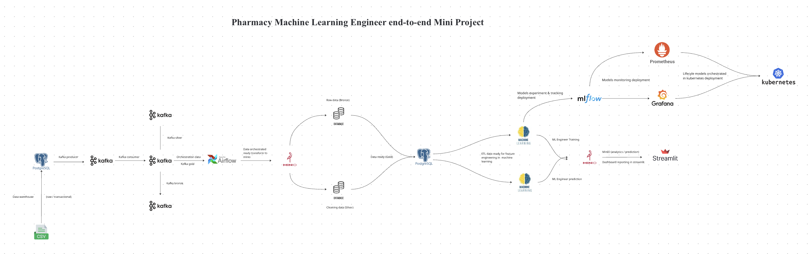
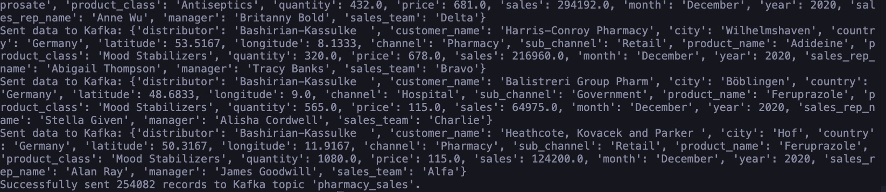
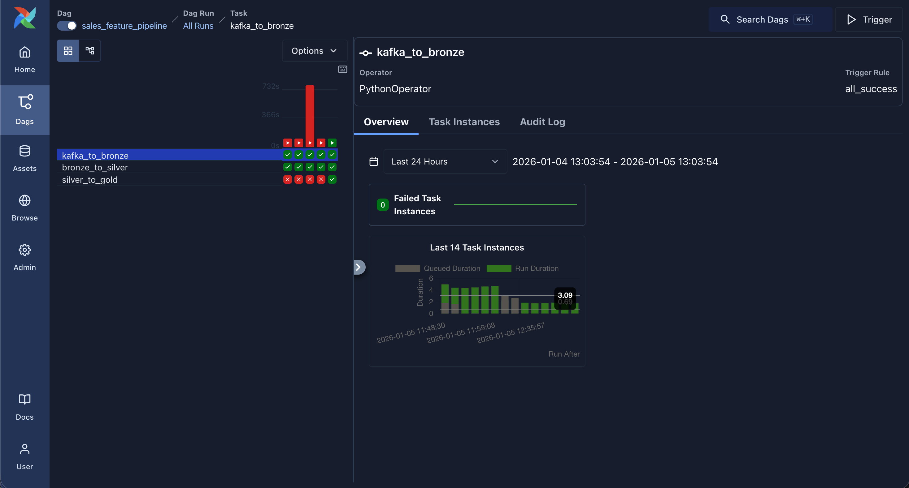
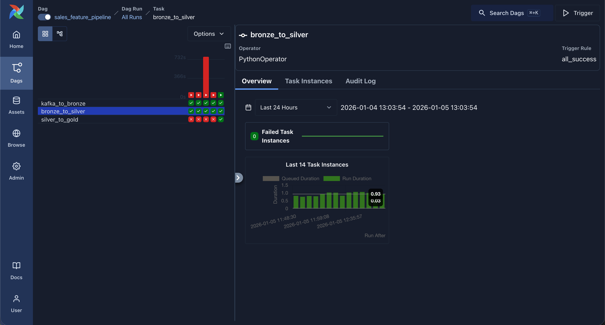
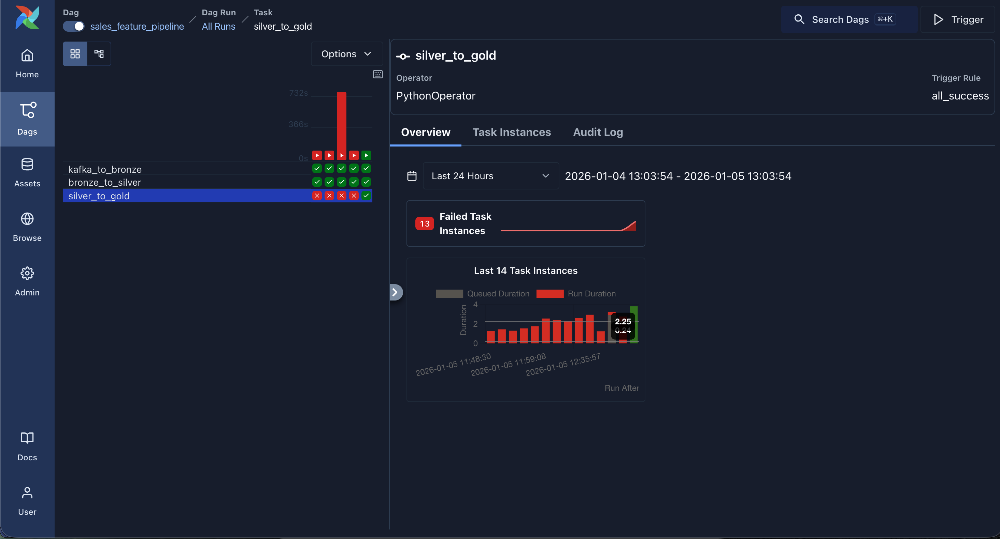
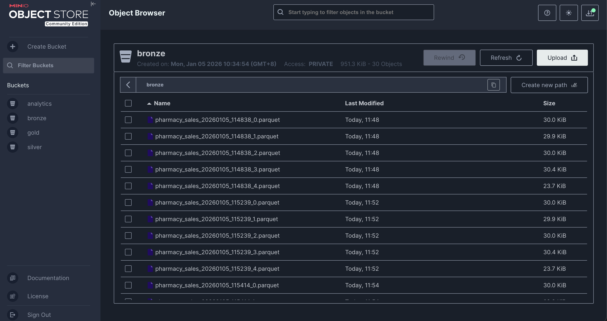
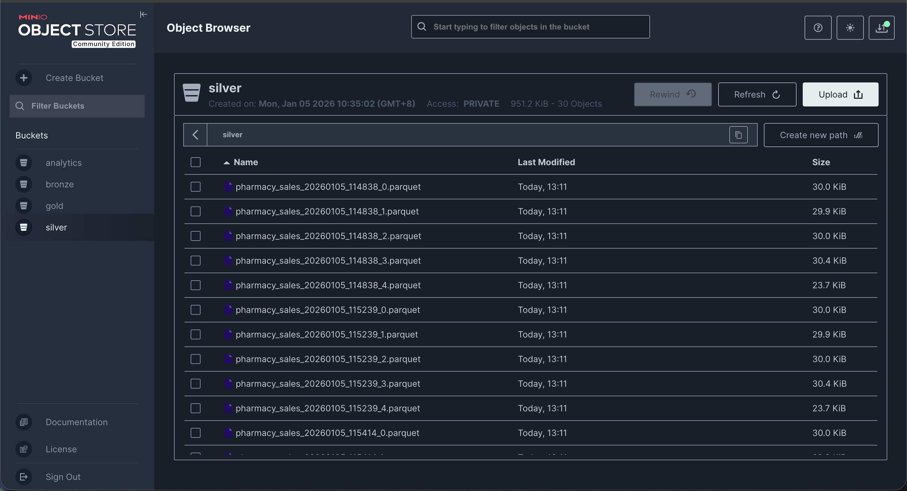
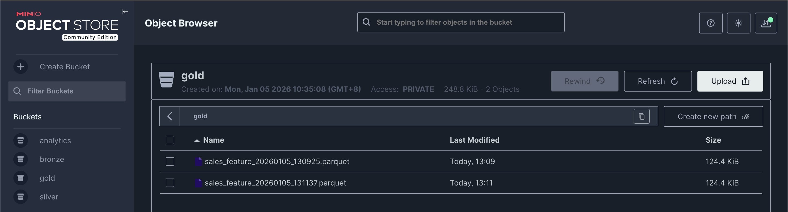
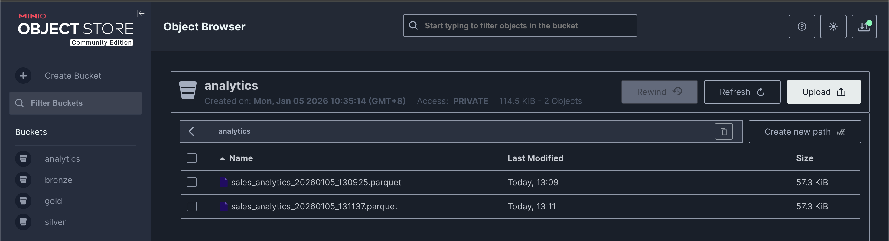

## Workflow Pharmacy Machine Learning Engineer end-to-end Mini Project 💊

This project are integrating Between Machine learning Engineer and Data engineer.

Business solution for complicated busineess in real world are using Artificial Intelligence by using ML Engineer and Data Engineer workflow set.

## Project purpose 🎯

- Increase sales revenue
- Reduced outlier distribution which made the company loss
- Define profit in growth sales
- Handle risk management and risk score
- Fraud detection in customer about the transaction

## Log project progress 👨‍💻

- Build structural workflow project in miro using tools
    - PostgreSQL
    - Kafka
    - Airflow
    - Minio
    - Machine learning alogrithm
    - Streamlit
- Ingest SQL database from big Pharmacy Sales project including SCHEMA raw, features, labels.
- Building Kafka producer and consumer for ingesting kafka data topic
- ETL airflow connection to kafka and ingesting to MinIO storage
- Build ML Engineer training data from gold kafka already data cleaned for catching
- Fundamental reliable, reproducible, and compatible for MLOps are
    
    **Infra → Data → Streaming → Orchestration → Feature → ML → Analytics**
    
- Run producer in kafka first for receiving data in kafka consumer
- Kafka has received a lot rows data from kafka producer
    
    
    
- Integrating airflow dags about 2 data list airflow/dags/sales_feature_pipeline.py and airflow/dags/sales_feature_pipeline_v2.py
- Success integrating airflow for sales_feature_pipeline
- Kafka to Bronze
    
    
    
- Kafka Bronze to Silver
    
    
    
- Kafka Silver to Gold
    
    
    
- Ingesting data from airflow in scheduling ETL was ingested to MinIO
- Bronze data transfered
    
    
    
- Silver data transfered
    
    
    
- Gold data transfered
    
    
    
- Analytics data transfered
    
    

- Integrating dashboard UI analytics visualization in Streamlit
    - Pharmacy Sales Analytics Dashboard
    
    
    
    - Sales Overview
    
    
    
    - Geographic Analysis
    
    
    
    - Detailed data
    
    
    
- 🚨 Totally warning alert!!! cuz inconsistant data belong to .parquet what was ingested. GO FIX IT CAUSE THIS IS NOT LOGICAL ENABLED